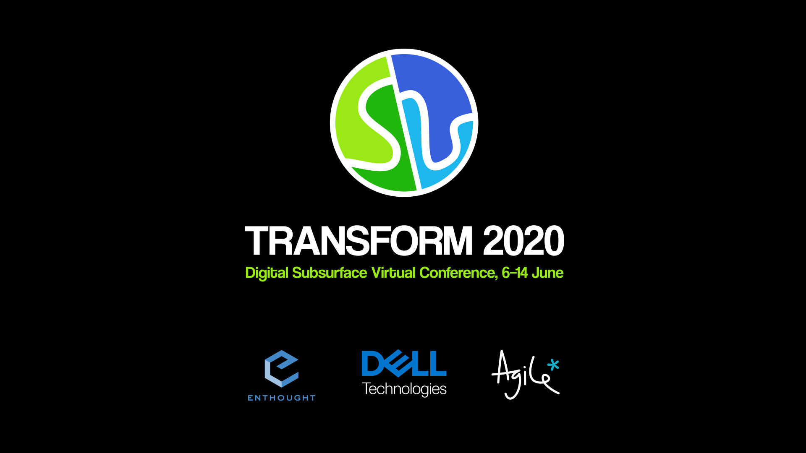

# transform2020-getting-started-python

## Tutorial: Getting Started with Python

DATE: Monday June 8, 2020 08:00 - 11:00 UTC

AUDIENCE: Beginner

INSTRUCTOR: Robert Leckenby, Digital Geoscientist, [Agile](https://agilescientific.com/)

### Video Stream:
 

## Welcome
Welcome to Transform 2020 and to Getting Started with Python! This session is open to all but is aimed at people who have never coded at all or who don't know Python. Ideally you should have watched the setup videos for [Windows](https://youtu.be/FdatS_NKVrM) or [Linux](https://youtu.be/3ncwbHyZeAg) and/or followed the instructions in the [Installation guide for the tutorials](http://swu.ng/t20-python-setup) that contained the information in those videos and more. This session is meant as a demo but if you followed those installation steps, you should be able to follow along. 

All session details are available [here](https://transform2020.sched.com/).

## Agenda
START:&nbsp;&nbsp;&nbsp;&nbsp;&nbsp;&nbsp;&nbsp;08.00 UTC

BREAK:&nbsp;&nbsp;&nbsp;&nbsp;&nbsp;&nbsp;09.30 UTC

RESUME:&nbsp;&nbsp;&nbsp;09.40 UTC

END:&nbsp;&nbsp;&nbsp;&nbsp;&nbsp;&nbsp;&nbsp;&nbsp;&nbsp;&nbsp;&nbsp;11.00 UTC

## Content

- Simple math, logic and flow control
- Modelling [Darcy's law](https://en.wikipedia.org/wiki/Darcy%27s_law) with a function
- Computing fold wavelengths with the [Ramberg-Biot](https://blogs.agu.org/mountainbeltway/2010/10/15/friday-fold-wavelength-contrast/) equation
- Geophysical wavelets with [`bruges`](https://github.com/agile-geoscience/bruges)
- Mapping DEM's with [`matplotlib`](https://matplotlib.org/)
- Data wrangling and QC well data with [`welly`](https://github.com/agile-geoscience/welly)
- Scanning a seismic cube with [`segyio`](https://github.com/equinor/segyio)

## Set up

The [anaconda documentation](https://docs.conda.io/projects/conda/en/latest/user-guide/concepts/environments.html#conda-environments) tells us that: "A conda environment [...] contains a specific collection of conda packages that you have installed." We use these environments to isolate different projects.

We will be using an environment called `transform2020` (but you can call it whatever you wish) that was created with:

`conda create --name transform2020 python=3.7 anaconda`

We then also install the [welly](https://github.com/agile-geoscience/welly), [segyio](https://github.com/equinor/segyio) and [bruges](https://github.com/agile-geoscience/bruges) packages to import \*.las and \*.sgy files and to perform geophysical calculations. First we activated the environment:

`conda activate transform2020`

and then installed the additional libraries:

`pip install welly segyio bruges`

You can then access this environment inside a jupyter notebook using one of two methods:
1. By running `pip install nb_conda_kernels` in `base` and then running `jupyter notebook` with `base` activated.
2. By running `python -m ipykernel install --user --name transform2020` after creating the `transform2020` environment and then running `jupyter notebook` with either `base` or `transform2020` activated.

In both cases you then need to select the `transform2020` environment by selecting `Kernel>Change kernel>kernel name` in the jupyter notebook browser window.